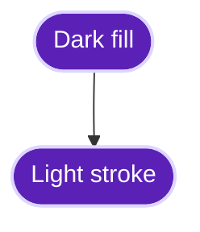
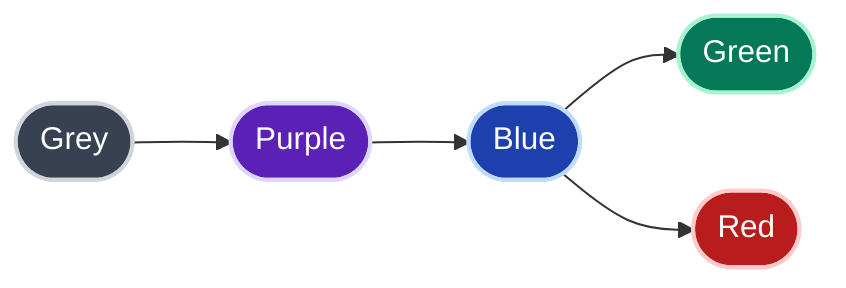

# mermaid-contrast

A [Claude Code](https://claude.ai/code) plugin that helps you create beautiful, high-contrast Mermaid diagrams that work perfectly in both light and dark mode on GitHub.

## The Problem

Mermaid diagrams often look great in one theme but break in another. Light fills disappear in dark mode. Coloured subgraphs clash with page backgrounds. Font Awesome icons render as literal text on GitHub.

## The Solution

This plugin teaches Claude a simple principle: **dark fills + light strokes = readable everywhere**.



## Themes

The plugin supports colour themes. It ships with a `standard` theme, and you can add your own custom themes (e.g., your company's brand colours).

### Built-in Theme

| Theme | Description |
|-------|-------------|
| `standard` | High-contrast palette (greys, purples, blues) |

### Theme Preview



### Adding Custom Themes

You can add your own themes (e.g., your company's brand colours) without modifying the core plugin:

1. **Create a theme file** in `themes/` (e.g., `themes/mytheme.md`)

2. **Follow the theme format** — see `themes/standard.md` as a template. Your theme file should include:
   - Core principles (dark fills + light strokes)
   - Colour palette table
   - Class definitions (`classDef` statements)
   - Subgraph style examples

3. **Set it as default** in `config.json`:
   ```json
   {
     "default_theme": "mytheme"
   }
   ```

4. **Request it by name** when creating diagrams:
   - "Create a flowchart using the mytheme theme"
   - "Draw this diagram with mytheme colours"

### Creating a Theme File

Your theme file should follow this structure:

```markdown
# My Theme

Description of your theme.

## Core Principles

(Same principles as standard theme — dark fills, light strokes, etc.)

## Colour Palette

| Name | Fill | Stroke | Usage |
|------|------|--------|-------|
| Primary | `#DARK1` | `#LIGHT1` | Primary elements |
| Secondary | `#DARK2` | `#LIGHT2` | Secondary elements |
...

## Class Definitions

\`\`\`mermaid
classDef primary fill:#DARK1,stroke:#LIGHT1,stroke-width:2px,color:#fff
classDef secondary fill:#DARK2,stroke:#LIGHT2,stroke-width:2px,color:#fff
\`\`\`
```

## Full Example

Here's a comprehensive example showing all the styling capabilities:


This example demonstrates:

- **Multiple colour classes** — User, API, service, database, error, success, decision
- **Various node shapes** — Circles `(())` for actors, stadiums `([""])` for actions, hexagons `{{""}}` for decisions, cylinders `[()]` for databases
- **Nested subgraphs** — With transparent fills and dashed borders
- **Different arrow types** — Solid `-->`, dashed `-.->`, and labelled `-->|text|`
- **Semantic colouring** — Green for success, red for errors, orange for decisions

## Installation

1. Add the marketplace:
   ```
   /plugin marketplace add BfdCampos/mermaid-contrast
   ```

2. Install the plugin:
   ```
   /plugin install mermaid-contrast@mermaid-contrast
   ```

3. Restart Claude Code

## Usage

The plugin adds a `mermaid` skill that Claude uses automatically when you ask it to create diagrams. Just ask Claude to create a flowchart, architecture diagram, or any Mermaid diagram — it will apply the high-contrast styling automatically using your configured default theme.

### Example prompts

- "Create a flowchart showing the user authentication flow"
- "Draw an architecture diagram for this microservice"
- "Visualise the data pipeline from ingestion to output"
- "Create a flowchart using my custom theme"

## What You Get

- **Universal readability** — Diagrams look great in light AND dark mode
- **GitHub compatibility** — No Font Awesome icons, proper subgraph syntax
- **Consistent styling** — Curated colour palettes with dark/light pairings
- **Custom themes** — Add your own brand colours without modifying the plugin
- **Best practices** — Rounded shapes, transparent subgraphs, proper quoting

## Colour Palette (Standard Theme)

| Colour | Fill | Stroke |
|--------|------|--------|
| Grey | `#374151` | `#d1d5db` |
| Purple | `#5b21b6` | `#ddd6fe` |
| Blue | `#1e40af` | `#bfdbfe` |
| Orange | `#c2410c` | `#fed7aa` |
| Green | `#047857` | `#a7f3d0` |
| Red | `#b91c1c` | `#fecaca` |
| Teal | `#0f766e` | `#99f6e4` |

## Viewing Mermaid Diagrams

Diagrams will render automatically on GitHub and Notion.

To view rendered Mermaid diagrams directly in your code editor, you may need to install a suitable extension or plugin:

- **VS Code or Cursor**: Install the [Markdown Mermaid](https://open-vsx.org/extension/bierner/markdown-mermaid) extension from the Extensions Marketplace.
- **Other Editors**: Search your editor's extension or plugin marketplace for "Mermaid" or "Markdown Mermaid" support.
