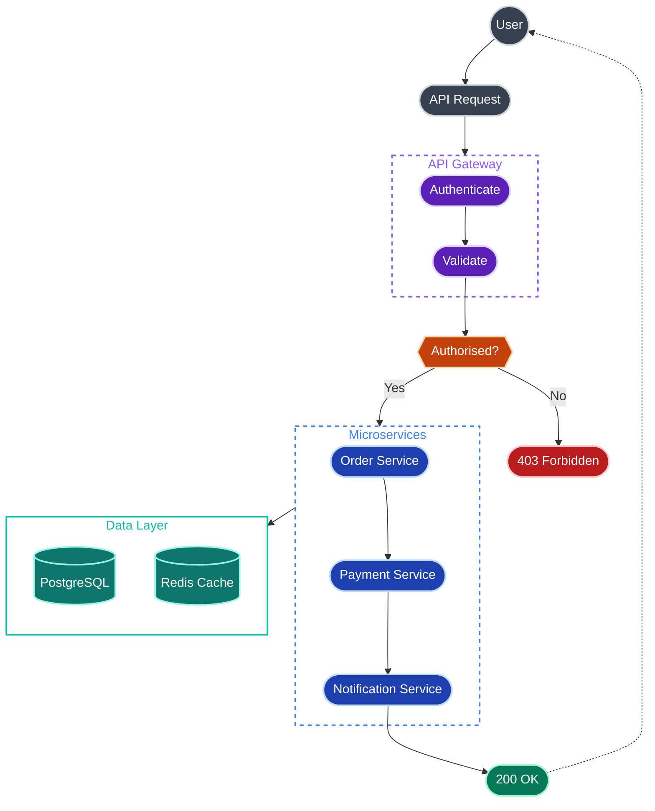

# mermaid-contrast

A [Claude Code](https://claude.ai/code) plugin that helps you create beautiful, high-contrast Mermaid diagrams that work perfectly in both light and dark mode on GitHub.

## The Problem

Mermaid diagrams often look great in one theme but break in another. Light fills disappear in dark mode. Coloured subgraphs clash with page backgrounds. Font Awesome icons render as literal text on GitHub.

## The Solution

This plugin teaches Claude a simple principle: **dark fills + light strokes = readable everywhere**.


## Full Example

Here's a comprehensive example showing all the styling capabilities:



This example demonstrates:

- **Multiple colour classes** — User, API, service, database, error, success, decision
- **Various node shapes** — Circles `(())` for actors, stadiums `([""])` for actions, hexagons `{{""}}` for decisions, cylinders `[()]` for databases
- **Nested subgraphs** — With transparent fills and dashed borders
- **Different arrow types** — Solid `-->`, dashed `-.->`, and labelled `-->|text|`
- **Semantic colouring** — Green for success, red for errors, orange for decisions

## Installation

1. Add the marketplace:
   ```
   /plugin marketplace add BfdCampos/mermaid-contrast
   ```

2. Install the plugin:
   ```
   /plugin install mermaid-contrast@mermaid-contrast
   ```

3. Restart Claude Code

## Usage

The plugin adds a `mermaid` skill that Claude uses automatically when you ask it to create diagrams. Just ask Claude to create a flowchart, architecture diagram, or any Mermaid diagram — it will apply the high-contrast styling automatically.

### Example prompts

- "Create a flowchart showing the user authentication flow"
- "Draw an architecture diagram for this microservice"
- "Visualise the data pipeline from ingestion to output"

## What You Get

- **Universal readability** — Diagrams look great in light AND dark mode
- **GitHub compatibility** — No Font Awesome icons, proper subgraph syntax
- **Consistent styling** — Curated colour palette with dark/light pairings
- **Best practices** — Rounded shapes, transparent subgraphs, proper quoting

## Colour Palette

The skill includes these pre-defined colour pairings:

| Colour | Fill | Stroke |
|--------|------|--------|
| Grey | `#374151` | `#d1d5db` |
| Purple | `#5b21b6` | `#ddd6fe` |
| Blue | `#1e40af` | `#bfdbfe` |
| Orange | `#c2410c` | `#fed7aa` |
| Green | `#047857` | `#a7f3d0` |
| Red | `#b91c1c` | `#fecaca` |
| Teal | `#0f766e` | `#99f6e4` |

