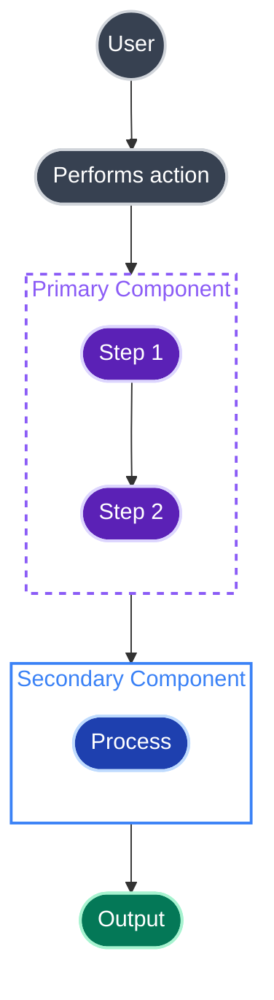
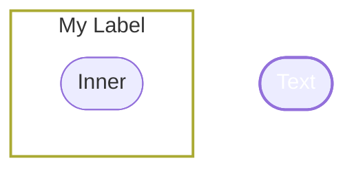

# Mermaid Diagram Skill

This skill provides guidance on creating beautiful, professional Mermaid diagrams that render correctly on GitHub and work well in both light and dark mode.

## Theme System

This skill supports multiple colour themes. Themes are loaded dynamically from the `themes/` folder.

### How Theme Selection Works

1. **Check `config.json`** in the repository root for the `default_theme` setting
2. **Load the theme file** from `themes/<theme_name>.md`
3. **User override**: If the user requests a specific theme by name, use that theme instead

### Loading Custom Themes

When a user requests a theme or when using the default:

1. Read `config.json` to find the `default_theme` value
2. Look for the corresponding file in `themes/` (e.g., `themes/mytheme.md`)
3. Use the colour palette and class definitions from that theme file
4. If the theme file doesn't exist, fall back to the `standard` theme

### Theme File Format

Each theme file in `themes/` should contain:
- A colour palette table with Fill and Stroke columns
- Class definitions (`classDef` statements)
- Subgraph style examples

## Core Principles

1. **Use dark fills with light strokes** — Ensures readability in both light and dark mode
2. **Set subgraph fills to `none`** — Allows subgraphs to adapt to any background
3. **Use rounded shapes** — `([text])` for stadium shapes, `((text))` for circles
4. **No Font Awesome icons** — GitHub doesn't support `fa:fa-*` icons, they render as text
5. **Quote subgraph labels** — Use `subgraph Name["Label Text"]` syntax
6. **Define classDef styles at the top** — Keep all styling together for maintainability

## The Golden Rule: Dark Fills + Light Strokes

The key insight for dark/light mode compatibility:

```
classDef myStyle fill:#DARK_COLOUR,stroke:#LIGHT_COLOUR,stroke-width:2px,color:#fff
```

- **Fill**: Use a darker shade (the node background)
- **Stroke**: Use a lighter shade of the same colour family (the border)
- **Color**: Always `#fff` (white text on dark background)

This approach ensures nodes are readable regardless of the page background.

---

## Theme: Standard

This is the built-in theme. Use it when `config.json` has `"default_theme": "standard"` or when no custom theme is specified.

### Colour Palette

| Name | Fill | Stroke | Usage |
|------|------|--------|-------|
| Grey | `#374151` | `#d1d5db` | Users, actors, neutral elements |
| Purple | `#5b21b6` | `#ddd6fe` | Primary actions, API components |
| Blue | `#1e40af` | `#bfdbfe` | Services, secondary components |
| Orange | `#c2410c` | `#fed7aa` | Decisions, warnings, branching |
| Green | `#047857` | `#a7f3d0` | Success states, completion |
| Red | `#b91c1c` | `#fecaca` | Errors, failures, blocked states |
| Teal | `#0f766e` | `#99f6e4` | Data, databases, storage |

### Class Definitions

```mermaid
classDef user fill:#374151,stroke:#d1d5db,stroke-width:2px,color:#fff
classDef primary fill:#5b21b6,stroke:#ddd6fe,stroke-width:2px,color:#fff
classDef secondary fill:#1e40af,stroke:#bfdbfe,stroke-width:2px,color:#fff
classDef accent fill:#c2410c,stroke:#fed7aa,stroke-width:2px,color:#fff
classDef success fill:#047857,stroke:#a7f3d0,stroke-width:2px,color:#fff
classDef error fill:#b91c1c,stroke:#fecaca,stroke-width:2px,color:#fff
classDef database fill:#0f766e,stroke:#99f6e4,stroke-width:2px,color:#fff
```

### Subgraph Styles

```mermaid
style Primary fill:none,stroke:#8b5cf6,stroke-width:2px,stroke-dasharray:5 5,color:#8b5cf6
style Secondary fill:none,stroke:#3b82f6,stroke-width:2px,color:#3b82f6
style Data fill:none,stroke:#14b8a6,stroke-width:2px,color:#14b8a6
```

---

## GitHub-Compatible Template

This is the canonical template for GitHub-rendered Mermaid diagrams. The class definitions shown use the **standard** theme — substitute with the appropriate theme colours as needed.



## Subgraph Syntax

### Wrong — Causes parse error
```mermaid
subgraph MyGroup [Label With Spaces]
```

### Correct — Quote the label
```mermaid
subgraph MyGroup["Label With Spaces"]
```

## Node Shapes

### Wrong — Square brackets are harsh
```mermaid
A[Square Node]
```

### Correct — Use rounded shapes
```mermaid
A(["Stadium shape"])     %% Rounded ends - use for most nodes
B((Circle))              %% Circle - use for users/actors
C{{"Decision"}}          %% Hexagon for decisions
D[(Database)]            %% Cylinder for databases/storage
```

## Subgraph Styling

### Wrong — Coloured fills break in dark mode
```mermaid
style MySubgraph fill:#f0f9ff,stroke:#3182ce
```

### Correct — Transparent fills adapt to any background
```mermaid
style MySubgraph fill:none,stroke:#8b5cf6,stroke-width:2px,stroke-dasharray:5 5,color:#8b5cf6
```

**Key points:**
- `fill:none` makes the background transparent
- `stroke-dasharray:5 5` creates a dashed border (optional, looks clean)
- `color:#...` sets the subgraph label colour to match the border

## Link Styling

```mermaid
A --> B              %% Solid arrow
A -.-> B             %% Dashed arrow
A -.->|Label| B      %% Dashed arrow with label
A ==> B              %% Thick arrow
```

## Common Mistakes

### Font Awesome icons (GitHub doesn't support them)
```mermaid
A[fa:fa-user User]  %% Renders as literal text
```

### Light fills with dark text
```mermaid
classDef bad fill:#ffffff,stroke:#000000,color:#000000  %% Invisible in dark mode
```

### Coloured subgraph fills
```mermaid
style Sub fill:#e0f2fe  %% Looks different in light vs dark mode
```

### Unquoted subgraph labels with spaces
```mermaid
subgraph Sub [My Label]  %% Parse error!
```

## Quick Reference



## When to Use This Skill

Invoke this skill when creating:
- Architecture diagrams for PRs
- System flow documentation
- Data pipeline visualisations
- Process flowcharts
- Any diagram in GitHub markdown

## GitHub-Specific Notes

1. **No Font Awesome** — GitHub's Mermaid renderer doesn't support FA icons
2. **No HTML** — Can't use `<br>` or other HTML in node labels
3. **Quote labels with spaces** — `subgraph X["Label"]` not `subgraph X [Label]`
4. **Test locally** — Use [mermaid.live](https://mermaid.live) to preview before committing
