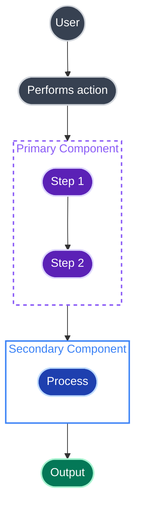

# Standard Theme

The original high-contrast colour palette. Dark fills with light strokes for universal readability.

## Core Principles

This theme follows the same principles as all mermaid-contrast themes:

1. **Use dark fills with light strokes** — Ensures readability in both light and dark mode
2. **Set subgraph fills to `none`** — Allows subgraphs to adapt to any background
3. **Use rounded shapes** — `([text])` for stadium shapes, `((text))` for circles
4. **No Font Awesome icons** — GitHub doesn't support `fa:fa-*` icons, they render as text
5. **Quote subgraph labels** — Use `subgraph Name["Label Text"]` syntax
6. **Define classDef styles at the top** — Keep all styling together for maintainability

## The Golden Rule: Dark Fills + Light Strokes

```
classDef myStyle fill:#DARK_COLOUR,stroke:#LIGHT_COLOUR,stroke-width:2px,color:#fff
```

- **Fill**: Use a darker shade (the node background)
- **Stroke**: Use a lighter shade of the same colour family (the border)
- **Color**: Always `#fff` (white text on dark background)

## Colour Palette

| Name | Fill | Stroke | Usage |
|------|------|--------|-------|
| Grey | `#374151` | `#d1d5db` | Users, actors, neutral elements |
| Purple | `#5b21b6` | `#ddd6fe` | Primary actions, API components |
| Blue | `#1e40af` | `#bfdbfe` | Services, secondary components |
| Orange | `#c2410c` | `#fed7aa` | Decisions, warnings, branching |
| Green | `#047857` | `#a7f3d0` | Success states, completion |
| Red | `#b91c1c` | `#fecaca` | Errors, failures, blocked states |
| Teal | `#0f766e` | `#99f6e4` | Data, databases, storage |

## Subgraph Strokes

| Name | Stroke Colour |
|------|---------------|
| Purple | `#8b5cf6` |
| Blue | `#3b82f6` |
| Teal | `#14b8a6` |

## Class Definitions

```mermaid
%% Define all classDef styles at the top of your diagram
classDef user fill:#374151,stroke:#d1d5db,stroke-width:2px,color:#fff
classDef primary fill:#5b21b6,stroke:#ddd6fe,stroke-width:2px,color:#fff
classDef secondary fill:#1e40af,stroke:#bfdbfe,stroke-width:2px,color:#fff
classDef accent fill:#c2410c,stroke:#fed7aa,stroke-width:2px,color:#fff
classDef success fill:#047857,stroke:#a7f3d0,stroke-width:2px,color:#fff
classDef error fill:#b91c1c,stroke:#fecaca,stroke-width:2px,color:#fff
classDef database fill:#0f766e,stroke:#99f6e4,stroke-width:2px,color:#fff
```

## Subgraph Styles

```mermaid
%% fill:none allows subgraphs to adapt to any background
style MySubgraph fill:none,stroke:#8b5cf6,stroke-width:2px,stroke-dasharray:5 5,color:#8b5cf6
```

## Node Shapes

Use rounded shapes for a polished look:

```mermaid
A(["Stadium shape"])     %% Rounded ends - use for most nodes
B((Circle))              %% Circle - use for users/actors
C{{"Decision"}}          %% Hexagon for decisions
D[(Database)]            %% Cylinder for databases/storage
```

## Complete Example


